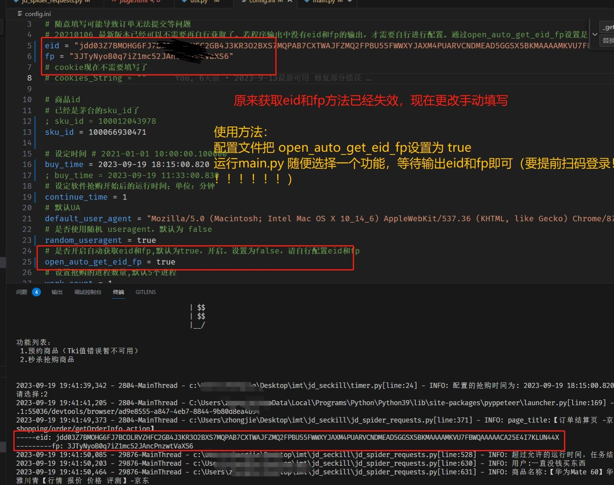

抢茅台 iqmaotai

注意：此代码为原作者代码，已失效。

## ~~关于收费~~
### 2023年 10 月 6号 停止维护

- [停止维护后](https://github.com/chao325/MaoTai_GUIT)

并在备注留下联系方式。（定制化开发其他软件请联系：zcsupercn@foxmail.com）


# 警惕骗子！！！

骗子自己没有start，就恶意的在我 lssues下辱骂。本人并没有接受他的任何赞助。如果还是这样，将永久停止仓库维护，大家都别赚了。

~~一堆别人的破代码卖 388 还扬言好货不便宜，便宜没好货~~  **骗子把价格降低到78了，388到78 可见降价幅度。代码明显是垃圾的**

**仓库地址为：https://github.com/huawei-hw/JD-2023-10-8**

**这个人的抢购成功截图用的是我用户的！！他的无效软件卖388 并且恶意诋毁我二次开发的脚本。在这里郑重承诺，如果我的脚本不能用，流程错误。调用不到JD接口，本人愿意十倍赔偿所有赞助者，并且承担任何法律责任！！！**

**我不要求任何人赞助我，但是绝对不让骗子好过，一堆垃圾代码399 还恶意诋毁。中国开源社区都给你这种傻逼染臭了**

**老子98代码赞助，我每天给人远程，凌晨一点多还在回消邮件，忙的键盘都冒烟了，试问各位赞助者，你们哪个问题我有不管不问？基本都做到有问必答。**
**98的赞助，python源代码+软件都给你。随便你用。还要怎样。傻逼骗子去死吧**

我刚刚才知道这个人是谁。是这样的他微信 在2023年9月26日加我好友。然后赞助了100块钱。期间，我不厌其烦。我在开车，晚上开长途回家走高速，都在解答他的问题。然后这个人程序自始至终都没出过问题。

结果一一直在问我关于他自己学习的问题，我就很纳闷，为什么你自己的学习成本加在我头上？？

即使这样，我还是解答他的问题，后面他没抢到，开始辱骂我。然后他发现自己骂错了。微信给我发消息说自己拉不来面子 才继续骂的我。我本人是非常支持他报警的。

最后我声明几个事情：

**我和他的聊天记录，可以公开，全程都保留。支持任何人报警求助**

**大家可以看看他的仓库，一个刚注册的GitHub新号去卖垃圾代码，还卖388 这个谁会去相信？上来的Github说明文件格式都和我相似。**


# 和恶意诋毁我的骗子聊天记录（部分）


**他的目的不仅是想要回去自己的100，也想继续以388的价格骗你们**
**老子不厌其烦解答问题，给他远程，半夜开高速都在回答他的问题。国庆假期也在回答。结果半夜凌晨两点多发消息骂我。现在开始诋毁我，还骗人钱。我真的是哭了。我他妈从来没遇到过这样的人。**
**现在想想真不值得，如果我晚上开长途还会消息，被车撞死了怎么办。我要绷不住了。**

## 不求大家赞助我，只求别让骗子得逞！！！

下面抢购成功是我的

<br/>


# 更新日志

**2023 年 9 月 21 号**
JD有变，更改了多个函数计算错误等问题。
- get_seckill_url
- request_seckill_checkout_page
- make_reserve 等

处理Tik值 sk值有误问题


**2023 年 9 月 19 号**
修复失效的eid和fp获取方法。
说明：
<br/>

<br/>

**2023 年 9 月 13 号**
  更新原作者留下报错问题
  解决了服务器时间错误问题
  修复了代码逻辑问题
  优化了抢购逻辑，抢购更快

## 以下为原作者介绍

---

### 20210113

- buy_time 可以不用再每天手动去进行设置修改，使用当天的日期

### Jd_Seckill

### 特别声明:

- 本仓库发布的`jd_seckill`项目中涉及的任何脚本，仅用于测试和学习研究，禁止用于商业用途，不能保证其合法性，准确性，完整性和有效性，请根据情况自行判断。

- 本项目内所有资源文件，禁止任何公众号、自媒体进行任何形式的转载、发布。

- `huanghyw` 对任何脚本问题概不负责，包括但不限于由任何脚本错误导致的任何损失或损害.

- 间接使用脚本的任何用户，包括但不限于建立 VPS 或在某些行为违反国家/地区法律或相关法规的情况下进行传播, `huanghyw` 对于由此引起的任何隐私泄漏或其他后果概不负责。

- 请勿将`jd_seckill`项目的任何内容用于商业或非法目的，否则后果自负。

- 如果任何单位或个人认为该项目的脚本可能涉嫌侵犯其权利，则应及时通知并提供身份证明，所有权证明，我们将在收到认证文件后删除相关脚本。

- 以任何方式查看此项目的人或直接或间接使用`jd_seckill`项目的任何脚本的使用者都应仔细阅读此声明。`huanghyw` 保留随时更改或补充此免责声明的权利。一旦使用并复制了任何相关脚本或`jd_seckill`项目，则视为您已接受此免责声明。
- 您必须在下载后的 24 小时内从计算机或手机中完全删除以上内容。
- 本项目遵循`GPL-3.0 License`协议，如果本特别声明与`GPL-3.0 License`协议有冲突之处，以本特别声明为准。

> **_您使用或者复制了本仓库且本人制作的任何代码或项目，则视为`已接受`此声明，请仔细阅读_**  
> **_您在本声明未发出之时点使用或者复制了本仓库且本人制作的任何代码或项目且此时还在使用，则视为`已接受`此声明，请仔细阅读_**

### 简介

通过我这段时间的使用（2020-12-12 至 2020-12-17），证实这个脚本确实能抢到茅台。我自己三个账号抢了四瓶，帮两个朋友抢了 4 瓶。
大家只要确认自己配置文件没有问题，Cookie 没有失效，坚持下去总能成功的。

根据这段时间大家的反馈，除了茅台，其它不需要加购物车的商品也不能抢。具体原因还没有进行排查，应该是京东非茅台商品抢购流程发生了变化。  
为了避免耽误大家的时间，先不要抢购非茅台商品。  
等这个问题处理好了，会上线新版本。

### 暗中观察

根据 12 月 14 日以来抢茅台的日志分析，大胆推断再接再厉返回 Json 消息中`resultCode`与小白信用的关系。  
这里主要分析出现频率最高的`90016`和`90008`。

### 样例 JSON

```json
{'errorMessage': '很遗憾没有抢到，再接再厉哦。', 'orderId': 0, 'resultCode': 90016, 'skuId': 0, 'success': False}
{'errorMessage': '很遗憾没有抢到，再接再厉哦。', 'orderId': 0, 'resultCode': 90008, 'skuId': 0, 'success': False}
```

### 数据统计

| 案例 | 小白信用 | 90016  | 90008  | 抢到耗时 |
| ---- | -------- | ------ | ------ | -------- |
| 张三 | 63.8     | 59.63% | 40.37% | 暂未抢到 |
| 李四 | 92.9     | 72.05% | 27.94% | 4 天     |
| 王五 | 99.6     | 75.70% | 24.29% | 暂未抢到 |
| 赵六 | 103.4    | 91.02% | 8.9%   | 2 天     |

### 猜测

推测返回 90008 是京东的风控机制，代表这次请求直接失败，不参与抢购。  
小白信用越低越容易触发京东的风控。

从数据来看小白信用与风控的关系大概每十分为一个等级，所以赵六基本上没有被拦截，李四和王五的拦截几率相近，张三的拦截几率最高。

风控放行后才会进行抢购，这时候用的应该是水库计数模型，假设无法一次性拿到所有数据的情况下来尽量的做到抢购成功用户的均匀分布，这样就和概率相关了。

> 综上，张三想成功有点困难，小白信用是 100+的用户成功几率最大。

## 主要功能

- 登陆京东商城（[www.jd.com](http://www.jd.com/)）
  - 用京东 APP 扫码给出的二维码
- 预约茅台
  - 定时自动预约
- 秒杀预约后等待抢购
  - 定时开始自动抢购

## 运行环境

- [Python 3](https://www.python.org/)
## 第三方库

- 需要使用到的库已经放在 requirements.txt，使用 pip 安装的可以使用指令  
  `pip install -r requirements.txt`
- 如果国内安装第三方库比较慢，可以使用以下指令进行清华源加速
  `pip install -r requirements.txt -i https://pypi.tuna.tsinghua.edu.cn/simple/`

## 使用教程

#### 1. 推荐 Chrome 浏览器

#### 2. 网页扫码登录，或者账号密码登录

#### 3. 填写 config.ini 配置信息

(1)`eid`和`fp`找个普通商品随便下单,然后抓包就能看到,这两个值可以填固定的

> 现在已经支持自动获取，因为添加了一个新的三方库，需要在程序运行之前再执行一次安装第三方库的命令  
> 如果想手动获取，随便找一个商品下单，然后进入结算页面，打开浏览器的调试窗口，切换到控制台 Tab 页，在控制台中输入变量`_JdTdudfp`，即可从输出的 Json 中获取`eid`和`fp`。

(2)`sku_id`,`default_user_agent`

> `sku_id`已经按照茅台的填好。
> `cookies_string` 现在已经不需要填写了
> `default_user_agent` 可以用默认的。谷歌浏览器也可以浏览器地址栏中输入 about:version 查看`USER_AGENT`替换

(3)配置一下时间

> 现在不强制要求同步最新时间了，程序会自动同步京东时间
>
> > 但要是电脑时间快慢了好几个小时，最好还是同步一下吧

以上都是必须的.

> tips：
> 在程序开始运行后，会检测本地时间与京东服务器时间，输出的差值为本地时间-京东服务器时间，即-50 为本地时间比京东服务器时间慢 50ms。
> 本代码的执行的抢购时间以本地电脑/服务器时间为准

(4)修改抢购瓶数

> 代码中默认抢购瓶数为 2，且无法在配置文件中修改
> 如果一个月内抢购过一瓶，最好修改抢购瓶数为 1
> 具体修改为：在`jd_spider_requests.py`文件中搜索`self.seckill_num = 2`，将`2`改为`1`

#### 4.运行 main.py

根据提示选择相应功能即可。如果出现请扫码登录的提示可查看项目目录下是否存在`qr_code.png`文件,若存在打开图片，并使用京东手机 APP 扫码登录即可。

- _Linux 下命令行方式显示二维码（以 Ubuntu 为例）_

```bash
$ sudo apt-get install qrencode zbar-tools # 安装二维码解析和生成的工具，用于读取二维码并在命令行输出。
$ zbarimg qr_code.png > qrcode.txt && cat qrcode.txt | qrencode -o - -t UTF8 # 解析二维码输出到命令行窗口。
```

#### 5.抢购结果确认

抢购是否成功通常在程序开始的一分钟内可见分晓！  
搜索日志，出现“抢购成功，订单号 xxxxx"，代表成功抢到了，务必半小时内支付订单！程序暂时不支持自动停止，需要手动 STOP！  
若两分钟还未抢购成功，基本上就是没抢到！程序暂时不支持自动停止，需要手动 STOP！

## Docker 运行

> - 自行准备`docker`或`docker-compose`环境
> - 修改`dockerfile`目录中的配置文件`docker.env`
> - 目前支持直接使用`docker`的方式进行管理，也支持`docker-compose`的方式进行管理，根据自己的使用习惯进行选择
> - 推荐使用`docker-compose`的方式，更方便一点
> - 最新代码合并到主分之后，镜像服务器构建新的镜像会需要大概 30 分钟的时间，请分支合并后一小时再拉取最新镜像

### 使用 Docker-Compose 进行容器管理（推荐）

#### 拉取镜像

```bash
# 如果不执行此步骤则启动容器时自动进行本地构建镜像
$ sudo docker-compose -f compose/docker-compose.yml pull
```

#### 启动容器

```bash
# 如镜像不存在会自动本地构建一个镜像
$ sudo docker-compose -f compose/docker-compose.yml up
```

> 注意：
>
> 1. 默认运行选项为秒杀
> 1. 容器默认前端运行，如果需要停止容器连续按两次`Ctrl+C`。
> 1. 如果想后端运行，执行命令`sudo docker-compose -f compose/docker-compose.yml up -d`。
> 1. 如果存在名称为`jd-seckill`的非`docker-compose`创建的容器，需要执行`sudo docker rm -f jd-seckill`先进行删除。

#### 查看登录二维码

```bash
$ sudo docker-compose -f compose/docker-compose.yml exec jd-seckill qrcode
```

#### 停止容器

```bash
$ sudo docker-compose -f compose/docker-compose.yml down -t 0
```

#### 滚动打印运行日志

```bash
$ sudo docker-compose -f compose/docker-compose.yml logs -f
```

#### 查看容器状态

```bash
$ sudo docker-compose -f compose/docker-compose.yml ps
```

### 使用 Docker 直接进行容器管理

#### 创建镜像

> 一共两种方式可以创建镜像，任选其一即可  
> 如果本地构建镜像失败，可以尝试拉取镜像的方式

```bash
# 第一种，直接从`DockerHub`仓库拉取镜像
$ sudo docker pull huanghyw/jd-seckill:latest

# 第二种，本地构建镜像
$ cd dockerfile
$ sudo docker build -t huanghyw/jd-seckill:latest .
```

#### 启动容器

```bash
$ cd dockerfile
$ sudo docker run -it --rm --env-file docker.env --name jd-seckill huanghyw/jd-seckill:latest
```

#### 查看登录二维码

```bash
$ sudo docker exec jd-seckill qrcode
```

#### 停止容器

```bash
$ sudo docker stop jd-seckill -t 0
```

#### 滚动打印运行日志

```bash
$ sudo docker logs jd-seckill -f
```

#### 查看容器状态

```bash
$ sudo docker ps -a
```

## 感谢

##### 非常感谢原作者 https://github.com/zhou-xiaojun/jd_mask 提供的代码

##### 也非常感谢 https://github.com/wlwwu/jd_maotai 进行的优化
